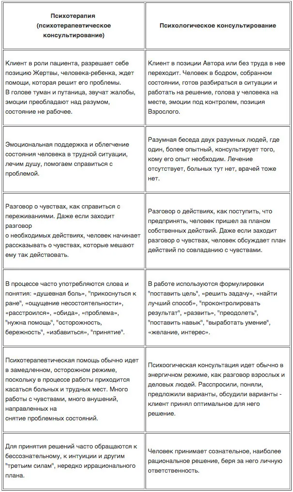
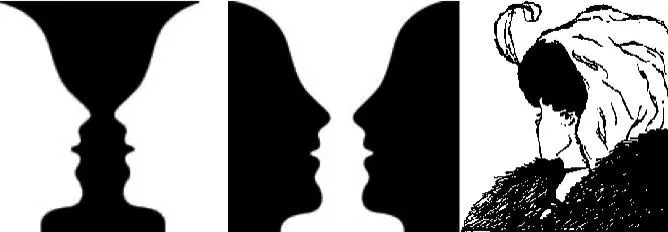
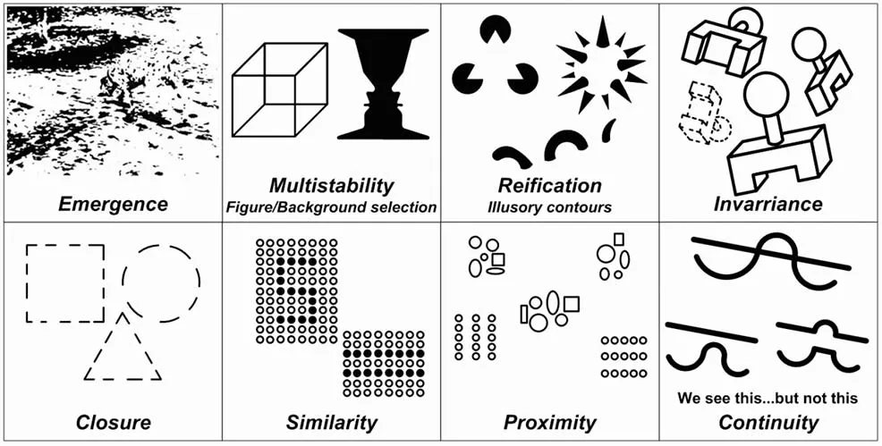
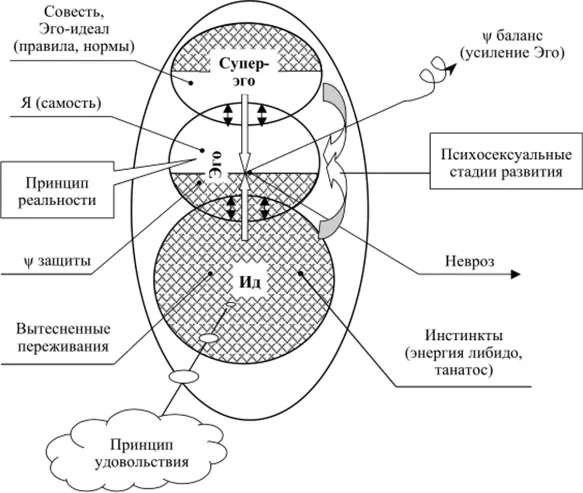
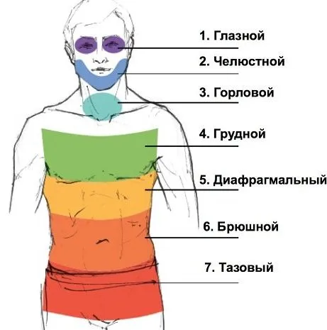
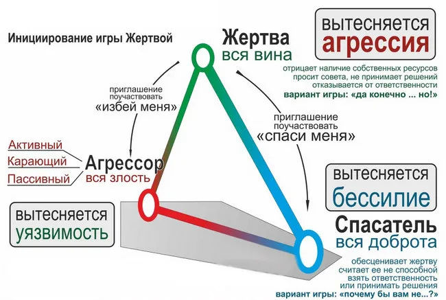

# Психология: общий обзор

*2021, январь 30*

«psyche» — душа, «logos» — наука

**Ψ** — это значок «пси», который в среде психологов используется как замена слова «психология»

> Разница между психологическим консультированием и психотерапией?

Один из вариантов ответа на данный вопрос:

Важное дополнение: недопустимо, когда вместо консультации клиенту начинают по факту навязывать психотерапию, также как явно недостаточно и просто мимо, когда психолог дает консультацию пациенту, который действительно нуждается в психотерапевтической помощи.

> В чём разница между психологом, психотерапевтом и психиатром?

**Психолог** — это про всех, кто занимается психической нормой и имеет высшее психологическое образование. При этом психологами могут быть ученые-исследователи, а могут быть практики (представители помогающей профессии).

**Психотерапевт** — это психолог-практик, который проводит психотерапию и психологическое консультирование. Одними из задач являются помочь клиенту узнать себя, услышать, аккумулировать внутренние ресурсы и самостоятельно найти наилучший путь решения проблемы, скорректировав мысли, поведение, мировоззрение и т. д.

**Психиатр** — человек с профессиональным медицинским образованием, который занимается диагностикой и лечением психических расстройств (в широком смысле — состояние психики, отличное от нормы). Толькоон может прописать медикаментозное лечение.

## Направления психологии

### Арт-терапия

Направление психотерапии, которая основана на творческой деятельности. В ее основе лежит применение изобразительного искусства с целью помочь человеку в тревожной или проблемной ситуации.

Например, рисование картин с использованием ярких красок, чтобы выплеснуть внутренние эмоции. Идея того, [как это можно сделать дома](https://www.loveasart.ru/loveasartkit)

### Бихевиоризм

Это направление в психологии, предметом изучения которого является поведение людей, животных посредством систематического подхода. Основная идея этого направления заключается в том, что человек ведет себя неосознанно, его поступки обуславливаются рефлексами и реакциями на триггеры окружающего мира и основаны на опыте предков. Ученые отрицали такое явление, как сознание, и утверждали, что действия человека напрямую зависят от происходящего вовне.

### Возрастная Ψ и Ψ развития

Отрасль психологии, изучающая психологические изменения человека по мере взросления. Исследует психику и человеческий организм во все возрастные периоды и на всех стадиях, принимая во внимание биологические, антропологические, социологические и психологические факторы, влияющие на его развитие.

### Возрастно-Ψ консультирование

Направление психотерапии, которое основывается на особенностях каждого возрастного периода человека. На каждом этапе жизни человека есть свои характерные особенности, кризисы, задачи и трудности.

### Гештальтпсихология

Предмет гештальтпсихологии — это сознание, понимание которого должно строиться на принципе целостности. Сознание с точки зрения гештальт-психологии представляет собой динамическое целое, где все взаимодействует друг с другом. Единицей анализа сознания выступает *гештальт*, т.е. целостная образная структура.

Принципы организации гештальта в зрительном восприятии:

- Проявление (Emergence)
- Мультистабильность выбора фигуры и фона (Multistability)
- Обоснованность иллюзорных контуров (Reification)
- Инвариантность (Invarriance)
- Законченность / завершенность (Closure)
- Сходство (Similarity)
- Близость (Proximity)
- Непрерывность (Continuity)

### Гештальт-терапия

(не является прямым последователем гештальтпсихологии)
Интерпретирует бессознательное пациента, направлена на развитие самосознания. В отличие от пассивного подхода психоанализа взаимодействует с клиентом активно, при этом между терапевтом и клиентом установлены равные-партнерские (гуманистические) взаимоотношения.

Основной подход гештальт-терапии называется экспериментально-феноменологическим: в ходе гештальт-терапии клиенту предлагается ставить эксперименты и наблюдать выявляемые в ходе экспериментов феномены.

Учась фиксировать в себе феномены, пациент развивает в себе осознавание — ключевое понятие гештальт-терапии. Успех гештальт-терапии в целом зависит от успешности развития этого навыка и обучения пациента применять этот навык в реальной жизни после окончания сеансов терапии.

### Гипнотерапия: гипнотические техники

*Гипноз* – это такой особый тип психического функционирования, при котором человек, благодаря воздействию другого человека, забывает о внешнем мире, сохраняя при этом связь с психологом, и который позволяет осуществлять психическое переструктурирование. В традиционном гипнозе считается, что гипноз – это особое состояние, в которое «погружаются» под влиянием гипнотизера. В эриксоновском считается, что это особый тип психического функционирования, в который вступают в диалоге.

### Детская Ψ

Сосредоточена на изучении закономерностей психического развития ребёнка. Тесно связана с педагогической Ψ и педагогикой, физиологией и возрастной морфологией.

Изучает этапы развития психики, виды деятельности (игра, труд, учение), формирование личности и т.д.

### Зоопсихология

Изучает психическую деятельность животных, её различия в видовом и индивидуальном аспектах. Например, взаимодействие животных друг с другом в рамках экосистемы.

### Когнитивная Ψ

Ориентирована на эксперимент и математическое моделирование мышления. Отрасль психологии, которая исследует познавательные процессы, такие, как память, внимание, чувства, представления информации, логическое мышление, воображение, способности к принятию решений.

Фактически многие коннективисты рассматривают мозг как детерминированный биокомпьютер, что делает когнитивную психологию смежной наукой с разработкой искусственного интеллекта. Многие алгоритмические модели, такие, как коннективисткая модель и алгоритмы искусственных нейронных сетей, активно используются как в когнитивной психологии, так и разработчиками искусственного интеллекта.

### *Коучинг*

*НЕ ЯВЛЯЕТСЯ НАПРАВЛЕНИЕМ ПСИХОЛОГИИ*

Это тренировки, в процессе которой человек, называющийся «коуч» (тренер), помогает обучающемуся достичь некой жизненной или профессиональной цели. В отличие от менторства, коучинг сфокусирован на достижении чётко определённых целей вместо общего развития.

Профессиональный коучинг включает такие техники как наводящее перефразирование, слушание, задавание вопросов, уточнение, которые помогают клиенту изменить перспективу и увидеть новые подходы к достижению желаемой цели. Вышеописанные техники применимы почти в любой разновидности коучинга. В этом смысле коучинг является «мета-профессией», позволяющей помочь клиенту в самых различных областях.

### Криминалистическая (криминальная) Ψ

Изучает психологические механизмы правонарушений и психологию правонарушителей, проблемы образования, структуры, функционирования и распада преступных групп.

Исследования в этой области глубоко изучают, что заставляет человека совершить преступление, а также реакцию после преступления — в суде и в тюремном заключении. Криминальные психологи часто вызываются в качестве свидетелей по судебным делам, чтобы помочь присяжным понять мотивы преступника.

### НЛП (нейролингвистическое программирование)

Не является наукой, но одним из направлений Ψ
Базируется не на теории, а на успешной практике.

**Нейро** - относится к мозговым процессам, содержит принципы сбора информации из внешнего мира с использованием 5 основных каналов, связанных с органами чувств.

**Лингвистика** - изучение языковых особенностей. Это преобразование полученной извне информации, пропущенной через фильтр внутреннего понимания событий и явлений, выраженное в структуре языка.

**Программирование** - способ контроля повседневных действий, интерпретации поведенческих особенностей, выбор путей преобразования действительности.

### Педагогическая Ψ (Ψ образования)

Раздел психологии, изучающий методы обучения и воспитания, повышающие эффективность выполнения образовательных задач, эффективность педагогических мер, улучшающие психологические аспекты преподавания и т. д.

### Ψ бизнес-консультирования

Психология бизнеса носит прикладной, практико-ориентированный характер. Изучение бизнеса как многопланового явления направлено на повышение эффективности бизнес-деятельности, оптимизацию взаимодействия субъектов бизнеса и интеграцию интересов бизнеса и общества, а также на оказание эффективной психологической помощи субъектам бизнеса.

### Ψ девиантного поведения

Ψ научная дисциплина, изучающая сущность и функционирование поведения, отклоняющегося от общепринятых стандартов и норм (моральных, религиозных, возрастных, этнических и пр.)

Такое поведение обусловлено либо дезадаптивным развитием психики и личностных свойств (например, агрессивности, самоуничижения, выученной беспомощности и пр.), либо гиперспособностями, либо определенным психическим состоянием человека (например, переживанием утраты, депрессией и т.д.)

### Ψ консультирование

Один из видов психологической помощи (наряду с психокоррекцией, психотерапией, психологическими тренингами и др.), выделившийся из психотерапии.

### Ψ коррекция

Направлена на исправление особенностей психологического развития, не соответствующих оптимальной модели, с помощью специальных средств психологического воздействия; а также — деятельность, направленная на формирование у человека нужных психологических качеств для повышения его социализации и адаптации к изменяющимся жизненным условиям.

### Ψ рекламы

Раздел психологии, который занимается оценкой нужд и ожиданий потребителя, разработкой психологических средств, приёмов, методов воздействия на людей с целью создания спроса на подлежащий сбыту товар или услуги.

### Ψ тренинги

Форма активного обучения навыкам поведения и развития личности. В тренинге участнику предлагается проделать те или иные упражнения, ориентированные на развитие или демонстрацию психологических качеств или навыков. *Не путать с групповой психотерапией.*

### Ψ труда, инженерная Ψ и эргономика

**Ψ труда** — рассматривает психологические особенности трудовой деятельности человека, закономерности развития трудовых навыков.

**Инженерная Ψ** — рассматривает процессы и средства информационного взаимодействия между человеком и машиной, а также техническими средствами автоматизации.

**Эргономика** — рассматривает трудовые процессы с целью создания оптимальных условий труда, способствующих росту его производительности.

### Ψ управления персоналом

Занимается изучением и разработкой эффективных управленческих методов, которые позволяют создавать благоприятные условия для максимального развития человеческого потенциала, что, в свою очередь, является основой развития предприятия.

### Ψ экстремальных ситуаций

Исследует проблемы, связанные с оценкой, предвидением и оптимизацией психических состояний и поведения человека в стрессовых ситуациях.

### Психоанализ

Характеризуется как ме­тод ис­сле­до­ва­ния пси­хи­ки, сис­те­ма зна­ний о по­ве­де­нии че­ло­ве­ка и спо­соб ле­че­ния пси­хич. за­бо­ле­ва­ний.

### Психодиагностика

Отрасль психологии, разрабатывающая теорию, принципы и инструменты оценки и измерения индивидуально-психологических особенностей личности.

### Психодрама

Это терапевтический групповой процесс, в котором используется инструмент драматической импровизации для изучения внутреннего мира человека.

### Психолингвистика

Дисциплина, которая находится на стыке психологии и лингвистики. Изучает взаимоотношение языка, мышления и сознания.

### Семейная Ψ и семейное консультирование

**Семейная Ψ** — раздел психологии, изучающий эволюцию и сущность брачно-семейных отношений, особенности их возникновения, становления, стабилизации и распада, описывающий характеристики семьи и брака в историческом, социально-психологическом, и индивидуально-психологическом контекстах, рассматривающий эмоциональную и функциональную специфику отношений членов семьи друг с другом.

### Сексология

Научная дисциплина, изучающая все проявления сексуальности человека, включая как попытки охарактеризовать нормальную сексуальность, так и изучение изменчивости сексуальных практик, включая и так называемые парафилии.

### Служба экстренной Ψ помощи

Например, оказание экстренной психологической помощи детям (преимущественно в составе семьи) в чрезвычайных и кризисных ситуациях; оказание психологической помощи субъектам образовательной среды в кризисных и экстремальных ситуациях; оказание экстренной психологической помощи детям, родителям, специалистам сферы образования по их запросу, средствами заочного (телефонного) или очного консультирования.

### Спортивная Ψ

Область психологической науки, которая изучает закономерности формирования и проявления различных психологических механизмов в спортивной деятельности.

### Социальная Ψ

Раздел психологии, занимающийся изучением закономерностей поведения и деятельности людей, обусловленных включением их в социальные группы, а также психологических характеристик самих групп.

### Судебная Ψ

В рамках судебной психологии разрабатываются проблемы судебно-психологической экспертизы, среди которых можно выделить: юридически значимые эмоциональные состояния как предмет экспертного исследования, юридическая (психологическая) составляющая вменяемости, психологические аспекты исследования беспомощного состояния потерпевших от сексуальных насильственных действий, юридически значимые психические явления как предмет экспертного психологического исследования, сравнительный анализ категорий «аффект» и «сильное душевное волнение» (широта и возможности исследования) и т.д.

### Телесно-ориентированная терапия

Направление психотерапии, работающее с проблемами и неврозами пациента через процедуры телесного контакта. Часто используется при работе с психосоматикой. См. ниже «Мышечный панцирь по В. Райху»

### Юридическая Ψ

Раздел психологии, предметом которого являются психологические особенности деятельности, связанной с правом: отправлением правосудия (поведение участников уголовного процесса), правомерным и неправомерным поведением (формирование личности преступника и особенности преступного поведения), работой сотрудников правоохранительных органов и других юридических служб.

### Экспериментальная Ψ

Общее обозначение всех видов научно-психологических исследований, осуществляемых посредством различных экспериментальных методов.

Экспериментальная психология представляет собой не какой-то особый вид психологии, а общий методологический подход, охватывающий самые различные области психологической науки.

### Этнопсихология

Изучает психические особенности различных рас, этносов и народов. Рассматривает также проблематику евгеники, нацизма, угнетения, рабства и т.д.

## Мышечный панцирь по Вильгельму Райху

Мышечный зажим — защитная реакция, следствие сдерживания определенных эмоций, когда человек желает заблокировать негативные чувства. Мышечный блок достаточно плохо поддается сознательному расслаблению, ему свойственно усиливаться в ответ на определенные эмоциональные раздражители.

В. Райх выделял 7 сегментов мускульного панциря, которые локализуются:

1. Защитный панцирь в области глаз выражается в том, что возникает ощущение, как будто глаза смотрят из-за неподвижной маски. Этот защитный панцирь удерживает страх и слёзы. Распускание осуществляется посредством раскрывания человеком глаз так широко, как только возможно, например, как это бывает при страхе. Это делается с целью, чтобы мобилизовать веки и лоб в принудительном эмоциональном выражении. Кроме того, для распускания данного панциря можно выполнять следующие движения глаз — по 20 раз вращать в одну сторону, а затем в другую. Также помогают движение глаз по диагонали — вверх-вниз.

2. Оральный сегмент включает мышцы подбородка, горла и затылка. Челюсть может быть слишком сжатой или неестественно расслабленной. Этот сегмент удерживает эмоциональное выражение плача, крика, гнева, кусания, сосания, гримасничанья. Защитный панцирь может быть расслаблен, если человек будет имитировать плач, произнесение звуков, мобилизующих губы, кусание, рвотные движения, делать гримасы.

3. Этот горловой сегмент включает глубокие мышцы шеи и язык. Защитный панцирь удерживает в основном гнев, крик и плач. Прямое воздействие на мышцы в глубине шеи невозможно, поэтому важными средствами распускания панциря являются крики, вопли, рвотные движения и т. п.

4. Грудной сегмент включает широкие мышцы груди, мышцы плеч, лопаток, всю грудную клетку и руки с кистями. Этот сегмент сдерживает смех, гнев, печаль, страстность. Сдерживание дыхания является важным средством подавления любой эмоции, осуществляется в значительной степени в груди, за счёт этого и происходит образование панциря. Панцирь может быть распущен посредством работы над дыханием. Рекомендуются дыхательные упражнения, в особенности с осуществлением полного выдоха. Руки и кисти используются для меткого удара, чтобы рвать, душить, бить, чтобы страстно достигать чего-то.

5. Диафрагма. Этот сегмент включает диафрагму, солнечное сплетение, различные внутренние органы, мышцы нижних позвонков. Защитный панцирь выражается в выгнутости позвоночника вперед, поэтому когда человек лежит, между нижней частью спины и кушеткой или полом остаётся значительный промежуток. Выдох оказывается труднее вдоха. Панцирь здесь удерживает в основном сильный гнев. Нужно в значительной степени распустить первые четыре сегмента, прежде чем перейти к распусканию этого посредством работы с дыханием и рвотным рефлексом (имитация рвотных движений), поскольку люди с сильными блоками на этом сегменте практически неспособны к рвоте.

6. Сегмент живота включает широкие мышцы живота и мышцы спины. Напряжение поясничных мышц связано со страхом нападения. Защитный панцирь на боках создаёт боязнь щекотки и связан с подавлением злости, неприязни. Распускание панциря в этом сегменте сравнительно нетрудно, если верхние сегменты уже открыты. Можно с помощью дыхания, где чередуется втягивание и надувание живота.

7. Последний сегмент включает все мышцы таза и нижних конечностей. Чем сильнее защитный панцирь, тем более таз вытянут назад, торчит сзади. Ягодичные мышцы напряжены и болезненны. Таз ригиден, он «мёртвый» и бисексуальный. Тазовый панцирь служит подавлением возбуждения, гнева, удовольствия.

8. Возбуждённость (тревожность) возникает из подавления ощущений сексуального удовольствия и невозможности полностью переживать удовольствие в этом районе, пока не разрядится гнев в тазовых мышцах. Панцирь может быть распущен посредством мобилизации таза, а затем лягания ногами и удара тазом по кушетке или полу.

## Треугольник Карпмана

Или «треугольник судьбы» — это психологическая и социальная модель взаимодействия между людьми в трансакционном анализе. Модель используется в психологии.

> Жертва на самом деле не так беспомощна, как себя чувствует; Спаситель на самом деле не помогает, а Преследователь на самом деле не имеет обоснованных претензий

Эта ситуация разыгрывается, когда возникают обстоятельства, в которых человек берет на себя роль жертвы или преследователя. Тогда другие люди берут себе другие роли.

Скрытая цель для каждого игрока и причина пребывания в ситуации в том, что каждый удовлетворяет их невысказанные (и часто бессознательные) психологические желания/потребности таким образом, который они считают приемлемым. При этом они не хотят признавать то, что в стратегическом плане эта ситуация принесёт им вред. Таким образом, каждый игрок действует из своих корыстных потребностей, а не из истинной ответственности или альтруистичности.

### Спаситель

Драматический спаситель играет свою роль в основном из-за того, что он вынужден спасать, чтобы избежать взгляда на свои собственные тревожности и скрытые чувства, поскольку жертва нуждается в их участии, как и в случае пожарного/спасителя.

Спаситель также может играть свою роль из-за крайне низкой самооценки. В таком случае скрытый мотив его действий понятен: он желает поднять самоценность в своих глазах.

### Жертва

Характерная особенность Жертвы — нежелание брать на себя ответственность. Она убеждена в своей неспособности к самостоятельной жизни и всегда ищет Спасителя, а также часто привлекает себе Преследователя (Агрессора), потому что подсознательно она не хочет выходить из своего пассивного положения, так как не хочет быть ответственной за свою жизнь. Если Жертве предлагается совет для разрешения её проблемы, она сразу же отвергает его, т.к. считает свои проблемы неразрешимыми. Из-за отказа от ответственности Жертвы часто страдают различными зависимостями: алкогольной, наркотической, обжорством и др.

### Агрессор (преследователь)

Для Преследователя характерно стремление властвовать над другими, доминировать над Жертвами, буквально нападать на других людей. Часто эту роль играют те, кто подвергся насилию, абьюзу в детстве. Подсознательно такие люди испытывают глубочайшее чувство стыда и беспомощности, которое они и пытаются подавить, преследуя других. Они также не берут на себя ответственность за то, что причиняют боль другим, ибо считают, что те люди заслужили подобного отношения.

Преследователь своим поведением пытается компенсировать свою несостоятельность, проецируя её на своих Жертв. Такие люди часто не осознают того, кем они являются, чувствуя себя жертвами.

